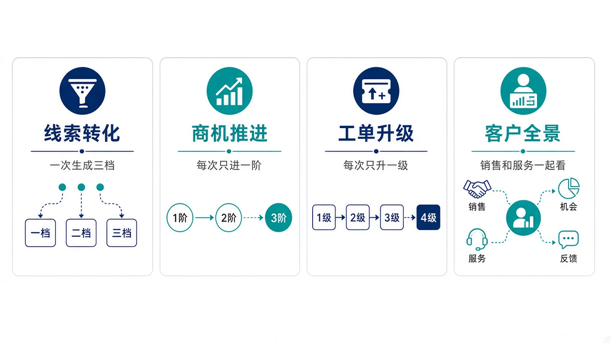
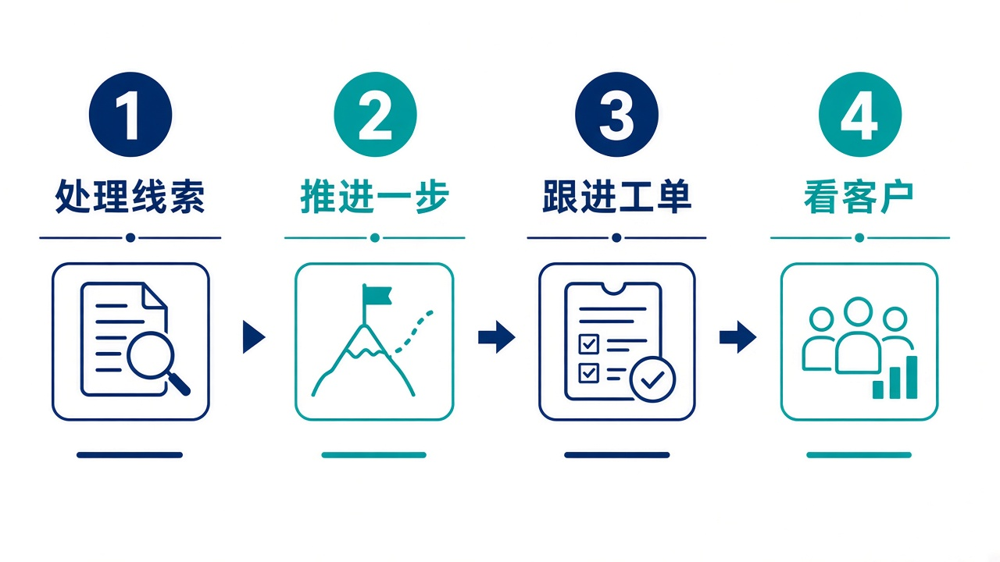

# 给大家讲：客户系统怎么用

CRM 管线索、客户、联系人、商机，以及服务工单。阶段和优先级由本系统往前推一档。控制塔只能请求前进一步或升级一次，而且必须带开放密钥。亮点短表见 [项目亮点](./项目亮点.md)。

## 适合什么场景

| 场景 | 在这里怎么做 |
| --- | --- |
| 一条线索已经值得跟 | 一次转成客户、联系人和商机，不用建三遍 |
| 商机要进入下一阶段 | 只指出是哪张商机。系统计算下一阶段，重复请求停在同一阶段 |
| 工单要升级 | 按工单号升一档优先级，保留 SLA 和评论。不会连跳两级 |
| 要看这个客户的全貌 | 打开客户 360，销售商机和服务工单在同一个客户下 |
| 控制塔想关单或改客户资料 | 做不到。它不建线索、不改客户、不关单 |

## 亮点

1. 转化一次生成销售需要的三张单据。
2. 调用方不用自己猜下一阶段或下一优先级。
3. 幂等保证同一次推进不会因为重复点击再走一档。
4. 知识库和活动留在客户服务过程里，不散到聊天记录。

## 一天怎么用

1. 处理新线索，决定转化还是继续培育。
2. 打开商机，只推进一步，并补上这次活动。
3. 看快到期的工单。需要升级时升一档，而不是直接改成最高。
4. 回看客户 360，确认商机和工单没有拆成两个客户。
